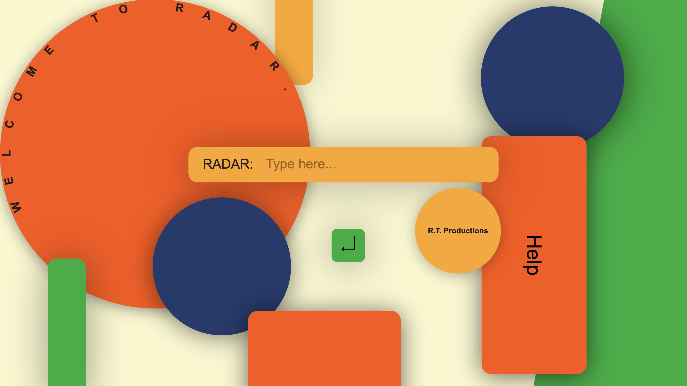

# R.T. Productions Travel Partner Application. [Visit us here](https://github.com/fac31/reza-todd-final)

</img>

## About

Meet RADAR, your newest travel companion. RADAR allows you to search any location in the world and receive up-to-date live information. 

The project is aimed at a customer base who are travelling or looking to travel and require a holistic overview of a location so that they can pack accordingly, gain an insight, and be prepared for their visit.

## Full-Stack Project

A final project to display our full-stack learning over the course of our studies with Founders and Coders. HTML, CSS, JavaScript, and Express.

## What we learned

- How to create an appealing user interface.
- Expanding knowledge in front end javascript through text rotation, pop-up information, image carousels.
- Demonstrating information in a dynamic way.
- Using several API's to provide a holistic application. 
- Realising a completed application with a functional front & back end.

## If we had more time

- Create a database to store locations people had previously researched.
- Enable a user to be able to compare different locations.

## How to install and use

**How to get started:**
`git clone git@github.com:fac31/reza-todd-final.git`

**Navigate to the directory:**
`cd reza-todd-final`

**Create a `.env` file in the root directory and add the following:**

`PORT=your_port_number`

**Install dependencies**
`pnpm install`

**Run the app**
`pnpm start`

**Run the app in dev mode**
`pnpm dev`

**Run the tests**
`pnpm test`

### Authors

